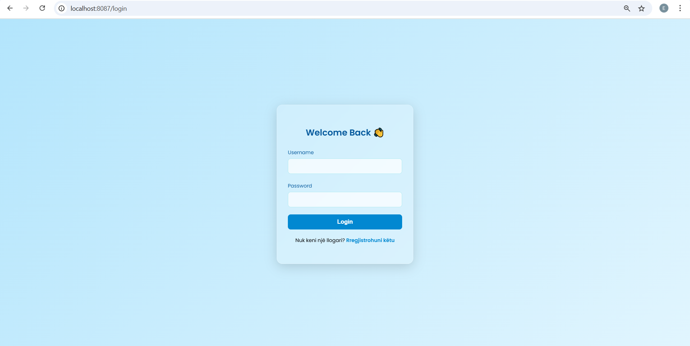
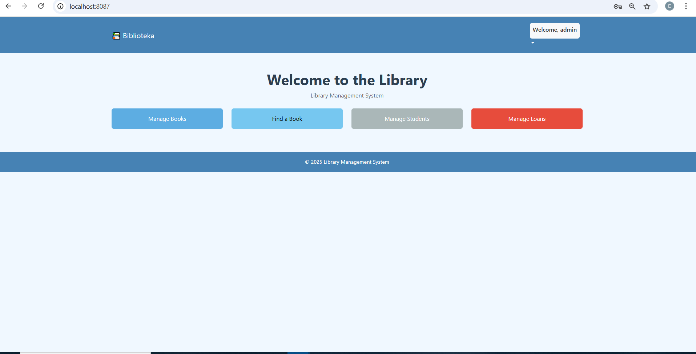
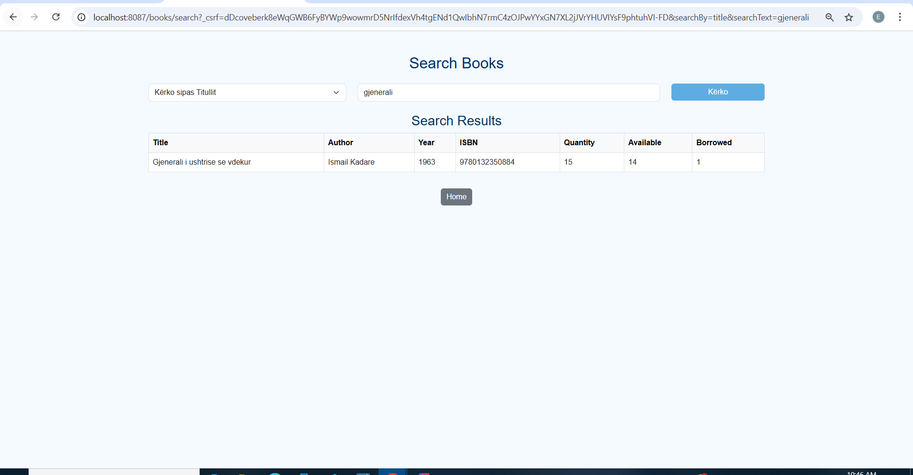

# 📚✨ Library Management System

> A lightweight and user-friendly system for managing books, students, and loans — developed using Java and Spring Boot.

---

## 🔶 Overview

The **Library Management System** is a web-based application designed to help librarians and students easily manage library operations.  
It allows users to log in, manage books, issue and return loans, and view current activities through a simple and warm user interface.

---

## 🌟 Features

- 📖 **Book Management** — Add, update, search, and delete books
- 👥 **User Roles** — Role-based login for librarians and students
- 🔄 **Loan Tracking** — Borrow and return books with due date checks
- 🔐 **Authentication System** — Secure login with unique roles
- 📊 **Dashboard Overview** — View library stats and active users

---

## 🛠️ Technologies Used

- 💻 Java  
- 🌱 Spring Boot  
- 🖼️ Thymeleaf (HTML Templates)  
- 🗄️ H2 In-Memory Database  
- 🎨 HTML + CSS  

---

## 🔐 User Roles

| Role          | Username  | Password |
|---------------|-----------|----------|
| **Librarian** | `admin`   | `admin`  |
| **Student**   | `student` | `student`|

Each user role has a different interface and access level.

---

## 📸 Screenshots

### 🔹 Login Page

### 🔹 Dashboard

### 🔹 Book Management

---

## 🙋‍♀️ Author

**Evisa Nela**  
📧 evisanela@gmail.com  
🌍 [GitHub Profile](https://github.com/Nela-2005)  
📍 Tirana, Albania

---

## 🏫 Course Info

This project was developed as part of the **Web Technologies and Programming** course at **Epoka University**.
It focuses on backend logic, data persistence, and a clean front-end experience using Spring Boot and Thymeleaf.
